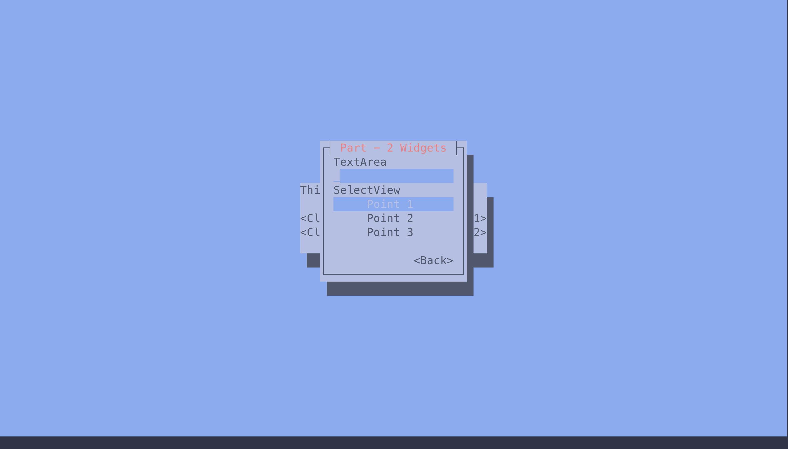
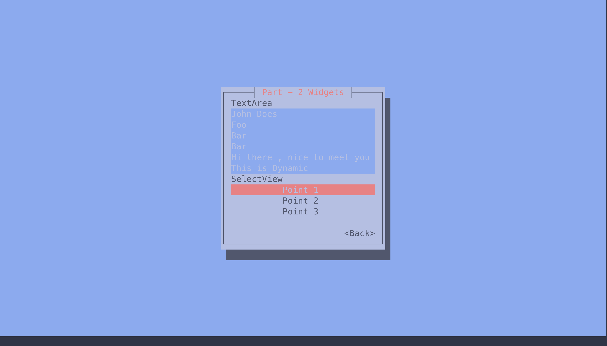
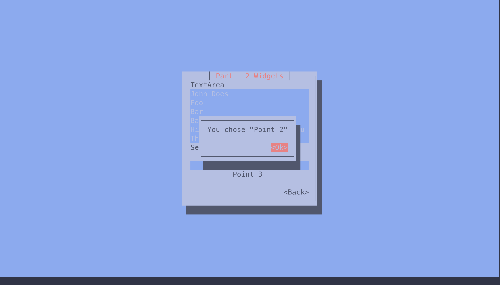
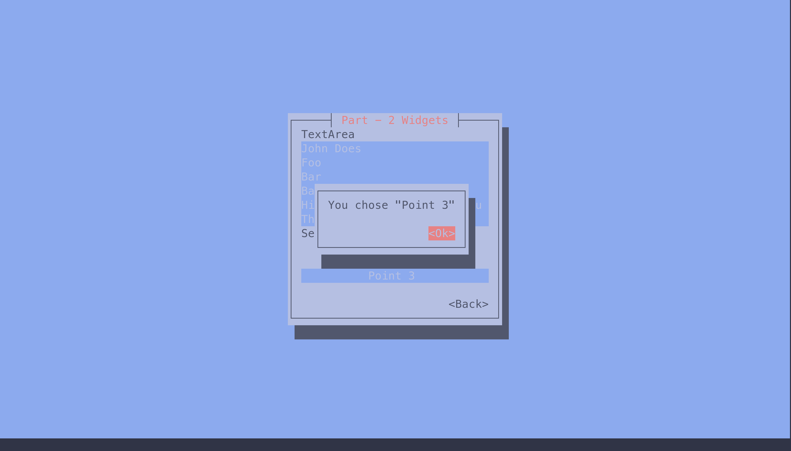

# UI_Elements.md

In this file , we will create a TUI containing all the basic UI elements found in cursive. 

## Images 

### Start Page 

  

  

### Part - 1 Elements 

  

  

  

### Part - 2 Elements 

  

  

  

  

