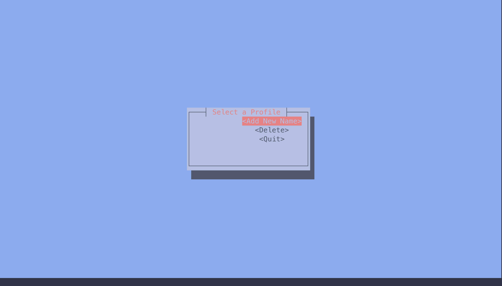
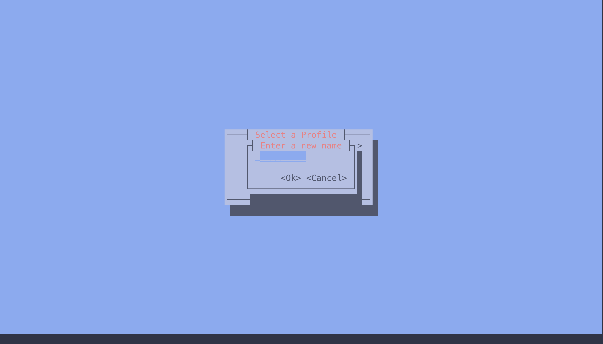
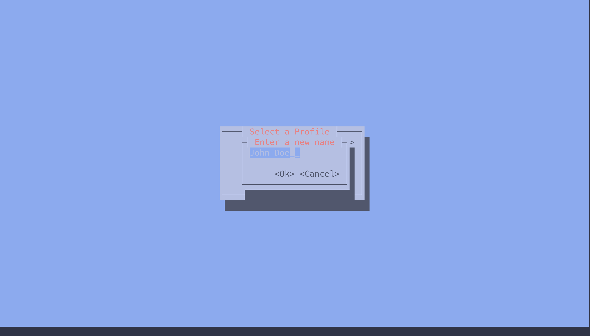
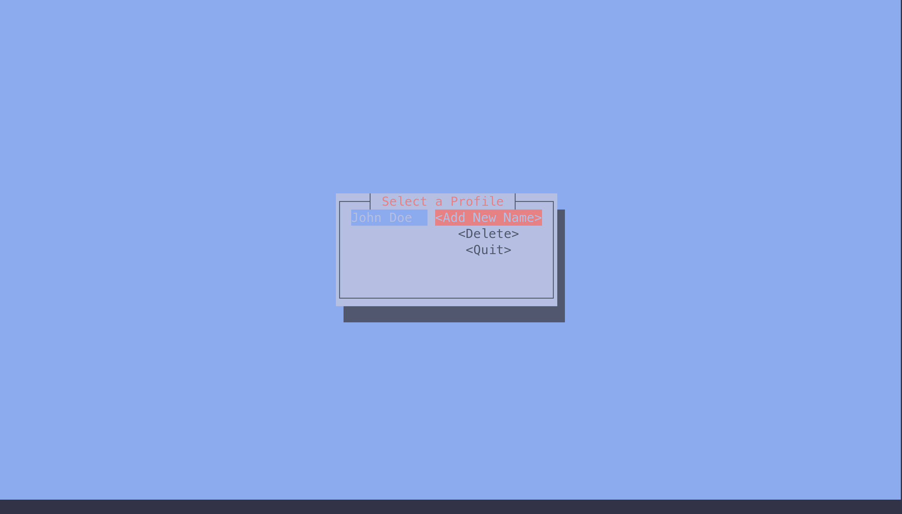
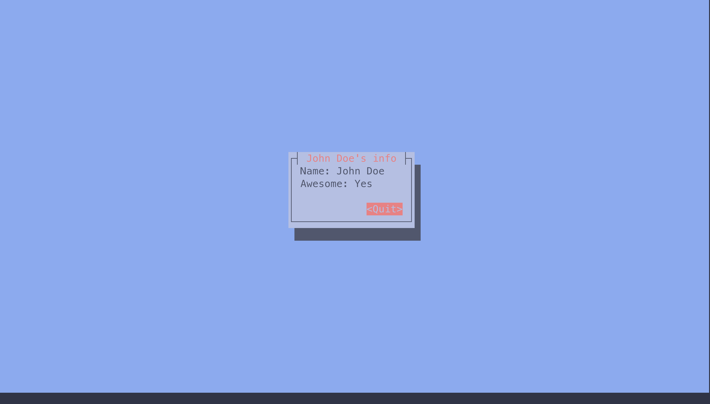

# Update_UI_Elements.md 

In this program , we will create a TUI in which we add new names to our view. 

## Images

### Start Page

### Enter Name Field

#### Empty 

#### Filled

### List of Names 

### Information on each name 

